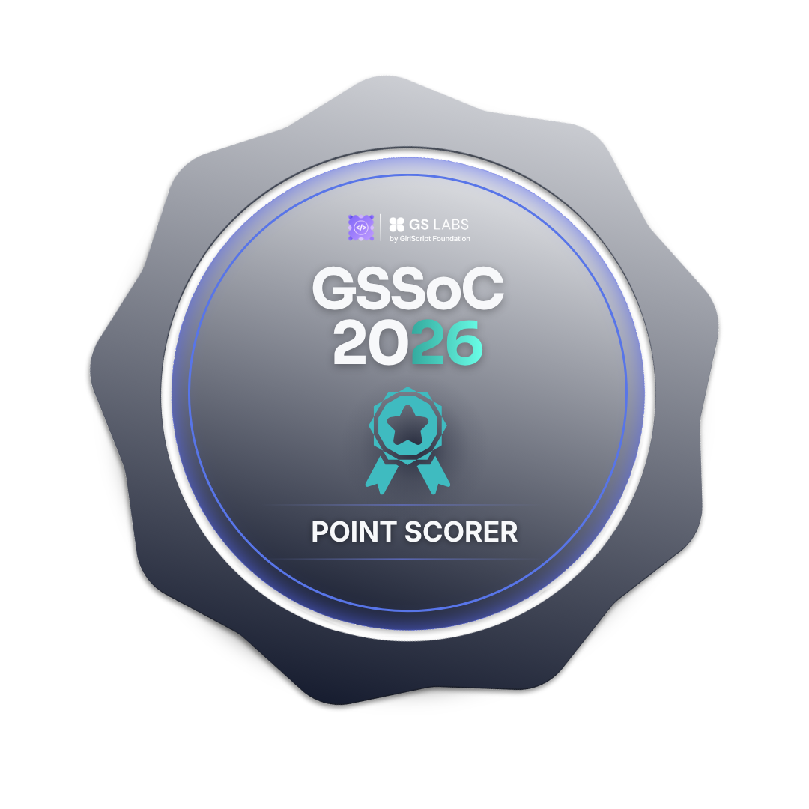
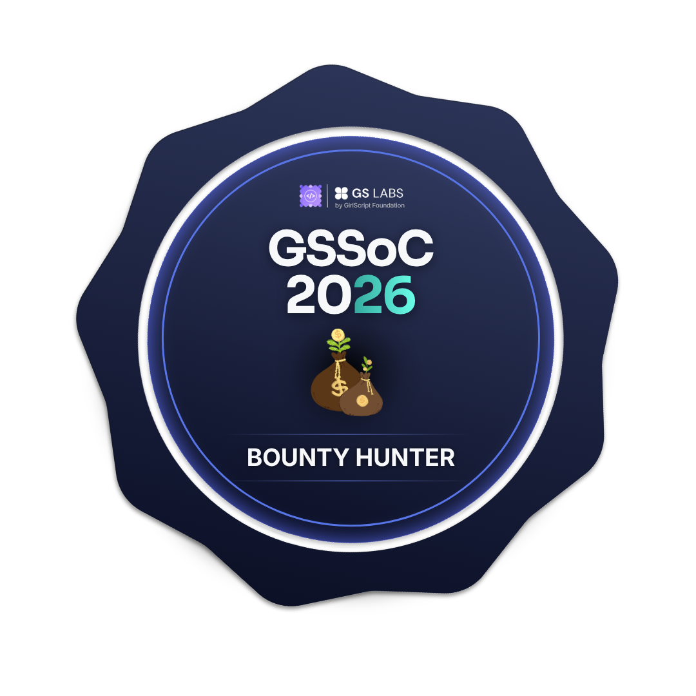

# Hi 👋, I'm Bhavya Gupta

### 🚀 CSE Student | Open Source Contributor | Hackathon Builder | Developer

💻 Passionate about building real-world projects and exploring new technologies.

🌸 Currently contributing to **GirlsScript Summer of Code 2026**

🏆 Participating in hackathons, building projects, and growing through open source.

- 🔭 Currently working on **Open Source Contributions**
- 🌱 Learning **DSA, AI/ML, Web Development & Core CS**
- 💡 Interested in **AI, Web Development, Open Source & Software Engineering**
- 🚀 Building projects and participating in **Hackathons**
- 🤝 Open to collaboration on interesting projects
- 
## 🏆 GSSoC 2026 Badges

  
  
  
  

  
  
  
  

  <b>🏅 Power Contributor | 🌸 Proud GSSoC 2026 Contributor | Building, Learning & Contributing to Open Source 🚀</b>

## 🌐 My Digital Portfolio

  

🚀 **[bhavyagupta.space](https://bhavyagupta.space)** is my personal digital space where I showcase my work, projects, experiments, and journey as a developer.

### 🔥 What you'll find there

- 💻 **Projects & Development Work** — Web applications, experiments, and technical projects
- 🚀 **Hackathons & Achievements** — My journey through hackathons, competitions, and learning experiences
- 🌸 **Open Source** — My contributions and growth through communities like GSSoC 2026
- 🤖 **AI & Technology** — Exploring AI, ML, automation, and emerging technologies
- 🌐 **Web Development** — Projects built using modern web technologies
- 📝 **Blogs & Learning Journey** — Sharing experiences, ideas, and things I learn along the way

  <b>🌟 Build • Learn • Experiment • Contribute • Repeat</b>

